# MySQL Join

## Introduction to MySQL join clauses


A relational database consists of multiple related tables linking together using common columns, which are known as foreign key columns. Because of this, data in each table is incomplete from the business perspective.

For example, in the sample database, we have the orders and orderdetails tables that are linked using the orderNumber column:


To get complete order’s information, you need to query data from both orders and orderdetails tables.

That’s why joins come into the play.

A join is a method of linking data between one (self-join) or more tables based on values of the common column between the tables.

MySQL supports the following types of joins:

1. Inner join
2. Left join
3. Right join
4. Cross join

To join tables, you use the cross join, inner join, left join, or right join clause. The join clause is used in the SELECT statement appeared after the FROM clause.

Note that MySQL hasn’t supported the FULL OUTER JOIN yet.

### Setting up sample tables

First, create two tables called members and committees:

```sql
CREATE TABLE members (
    member_id INT AUTO_INCREMENT,
    name VARCHAR(100),
    PRIMARY KEY (member_id)
);

CREATE TABLE committees (
    committee_id INT AUTO_INCREMENT,
    name VARCHAR(100),
    PRIMARY KEY (committee_id)
);
```

Second, insert some rows into the tables members and committees :

```sql
INSERT INTO members(name)
VALUES('John'),('Jane'),('Mary'),('David'),('Amelia');

INSERT INTO committees(name)
VALUES('John'),('Mary'),('Amelia'),('Joe');
```

Third, query data from the tables members and committees:

```sql
SELECT * FROM members;
```

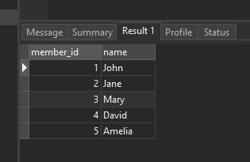
```sql
SELECT * FROM committees;
```
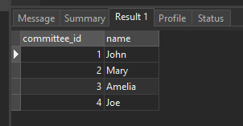

Some members are committee members, and some are not. On the other hand, some committee members are in the members table, some are not.

## MySQL INNER JOIN clause

The following shows the basic syntax of the inner join clause that joins two tables table_1 and table_2:

```sql
SELECT column_list
FROM table_1
INNER JOIN table_2 ON join_condition;
```

The inner join clause joins two tables based on a condition which is known as a join predicate.

The inner join clause compares each row from the first table with every row from the second table.

If values from both rows satisfy the join condition, the inner join clause creates a new row whose column contains all columns of the two rows from both tables and includes this new row in the result set. In other words, the inner join clause includes only matching rows from both tables.

If the join condition uses the equality operator (=) and the column names in both tables used for matching are the same, and you can use the USING clause instead:

```sql
SELECT column_list
FROM table_1
INNER JOIN table_2 USING (column_name);
```

The following statement uses an inner join clause to find members who are also the committee members:

```sql
SELECT
    m.member_id,
    m.name AS member,
    c.committee_id,
    c.name AS committee
FROM
    members m
INNER JOIN committees c ON c.name = m.name;
```

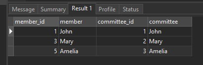

In this example, the inner join clause use the values in the name columns in both tables members and committees to match.

The following Venn diagram illustrates the inner join:


Because both tables use the same column to match, you can use the USING clause as shown in the following query:

```sql
SELECT
    m.member_id,
    m.name AS member,
    c.committee_id,
    c.name AS committee
FROM
    members m
INNER JOIN committees c USING(name);
```

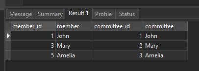
### MySQL LEFT JOIN clause

Similar to an inner join, a left join also requires a join predicate. When joining two tables using a left join, the concepts of left and right tables are introduced.

The left join selects data starting from the left table. For each row in the left table, the left join compares with every row in the right table.

If the values in the two rows satisfy the join condition, the left join clause creates a new row whose columns contain all columns of the rows in both tables and includes this row in the result set.

If the values in the two rows are not matched, the left join clause still creates a new row whose columns contain columns of the row in the left table and NULL for columns of the row in the right table.

In other words, the left join selects all data from the left table whether there are matching rows exist in the right table or not.

In case there are no matching rows from the right table found, the left join uses NULLs for columns of the row from the right table in the result set.

Here is the basic syntax of a left join clause that joins two tables:

```sql
SELECT column_list
FROM table_1
LEFT JOIN table_2 ON join_condition;
```

The left join also supports the USING clause if the column used for matching in both tables are the same:

```sql
SELECT column_list
FROM table_1
LEFT JOIN table_2 USING (column_name);
```

The following example uses a left join clause to join the members with the committees table:

```sql
SELECT
    m.member_id,
    m.name AS member,
    c.committee_id,
    c.name AS committee
FROM
    members m
LEFT JOIN committees c USING(name);
```

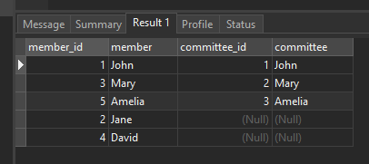

The following Venn diagram illustrates the left join:


This statement uses the left join clause with the USING syntax:

```sql
SELECT
    m.member_id,
    m.name AS member,
    c.committee_id,
    c.name AS committee
FROM
    members m
LEFT JOIN committees c USING(name);
```

To find members who are not the committee members, you add a WHERE clause and IS NULL operator as follows:

```sql
SELECT
    m.member_id,
    m.name AS member,
    c.committee_id,
    c.name AS committee
FROM
    members m
LEFT JOIN committees c USING(name)
WHERE c.committee_id IS NULL;
```

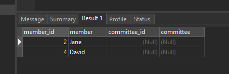

Generally, this query pattern can find rows in the left table that do not have corresponding rows in the right table.

This Venn diagram illustrates how to use the left join to select rows that only exist in the left table:


### MySQL RIGHT JOIN clause

The right join clause is similar to the left join clause except that the treatment of left and right tables is reversed. The right join starts selecting data from the right table instead of the left table.

The right join clause selects all rows from the right table and matches rows in the left table. If a row from the right table does not have matching rows from the left table, the column of the left table will have NULL in the final result set.

Here is the syntax of the right join:

```sql
SELECT column_list
FROM table_1
RIGHT JOIN table_2 ON join_condition;
```

Similar to the left join clause, the right clause also supports the USING syntax:

```sql
SELECT column_list
FROM table_1
RIGHT JOIN table_2 USING (column_name);
```

To find rows in the right table that does not have corresponding rows in the left table, you also use a WHERE clause with the IS NULL operator:

```sql
SELECT column_list
FROM table_1
RIGHT JOIN table_2 USING (column_name)
WHERE column_table_1 IS NULL;
```

This statement uses the right join to join the members and committees tables:

```sql
SELECT
    m.member_id,
    m.name AS member,
    c.committee_id,
    c.name AS committee
FROM
    members m
RIGHT JOIN committees c on c.name = m.name;
```

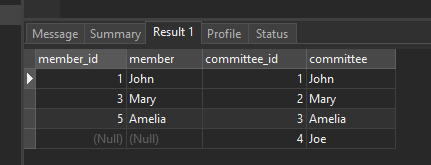

This Venn diagram illustrates the right join:
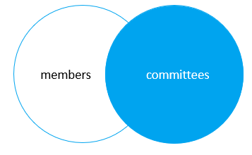

The following statement uses the right join clause with the USING syntax:

```sql
SELECT
    m.member_id,
    m.name AS member,
    c.committee_id,
    c.name AS committee
FROM
    members m
RIGHT JOIN committees c USING(name);
```

To find the committee members who are not in the members table, you use this query:

```sql
SELECT
    m.member_id,
    m.name AS member,
    c.committee_id,
    c.name AS committee
FROM
    members m
RIGHT JOIN committees c USING(name)
WHERE m.member_id IS NULL;
```

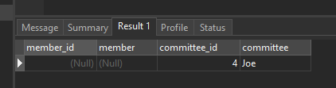

This Venn diagram illustrates how to use the right join to select data that exists only in the right table:

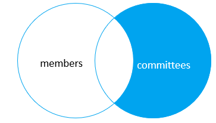

### MySQL CROSS JOIN clause

Unlike the inner join, left join, and right join, the cross join clause does not have a join condition.

The cross join makes a Cartesian product of rows from the joined tables. The cross join combines each row from the first table with every row from the right table to make the result set.

Suppose the first table has n rows and the second table has m rows. The cross join that joins the tables will return nxm rows.

The following shows the syntax of the cross join clause:

```sql
SELECT select_list
FROM table_1
CROSS JOIN table_2;
```

This example uses the cross join clause to join the members with the committees tables:

```sql
SELECT
    m.member_id,
    m.name AS member,
    c.committee_id,
    c.name AS committee
FROM
    members m
CROSS JOIN committees c;
```

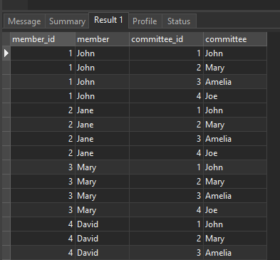

The cross join is useful for generating planning data. For example, you can carry the sales planning by using the cross join of customers, products, and years.

In this tutorial, you have learned various MySQL join statements, including cross join, inner join, left join, and right join, to query data from two tables.

## Summary

In summary, joins play a crucial role in combining data from multiple tables. INNER JOIN, LEFT JOIN, RIGHT JOIN, FULL JOIN, and CROSS JOIN are the different types of joins used for specific purposes in MySQL queries.

- Joins are essential in SQL to combine rows from different tables based on a related column between them.
- INNER JOIN is the most commonly used join type, which returns only the matched rows from both tables.
- LEFT JOIN retrieves all rows from the left table and the matched rows from the right table. If no match is found, NULL values are returned.
- RIGHT JOIN is the opposite of a LEFT JOIN, returning all rows from the right table and the matched rows from the left table.
- FULL JOIN (or FULL OUTER JOIN) returns all rows from both tables, combining the results of LEFT JOIN and RIGHT JOIN. It includes unmatched rows from both tables.
- CROSS JOIN is used to generate the Cartesian product of two tables, producing all possible combinations of rows between them.
