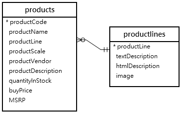
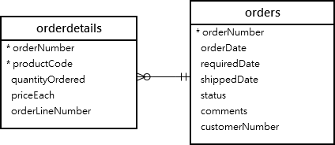
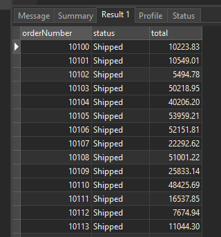
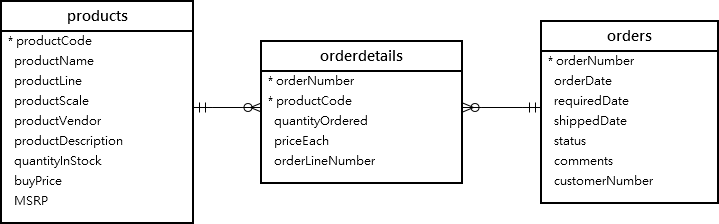
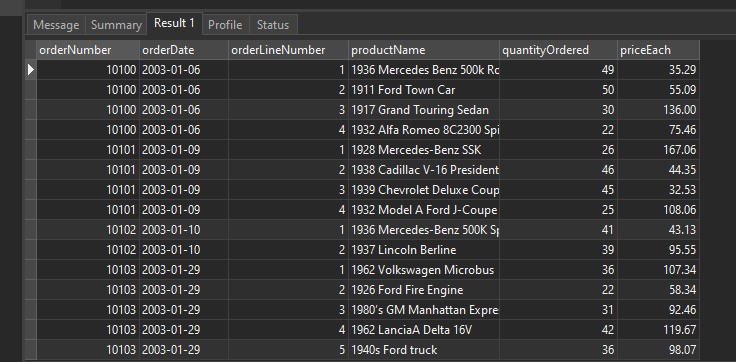
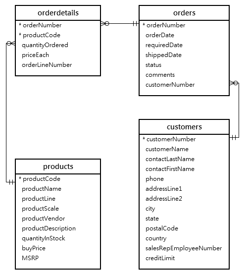
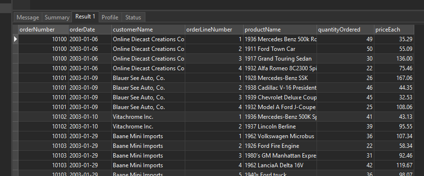
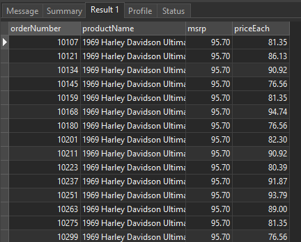

# MySQL INNER JOIN

## Introduction to MySQL INNER JOIN clause

The INNER JOIN matches each row in one table with every row in other tables and allows you to query rows that contain columns from both tables.

The INNER JOIN is an optional clause of the SELECT statement. It appears immediately after the FROM clause. Here is the syntax of the INNER JOIN clause:

```sql
SELECT
    select_list
FROM t1
INNER JOIN t2 ON join_condition1
INNER JOIN t3 ON join_condition2
...;
```

In this syntax:

- First, specify the main table that appears in the FROM clause (t1).
- Second, specify the table that will be joined with the main table, which appears in the INNER JOIN clause (t2, t3,…).
- Third, specify a join condition after the ON keyword of the INNER JOIN clause. The join condition specifies the rule for matching rows between the main table and the table appeared in the INNER JOIN clause.

Assuming that you want to join two tables t1 and t2.

The following statement illustrates how to join two tables t1 and t2 using the INNER JOIN clause:

```sql
SELECT
     select_list
FROM
     t1
INNER JOIN t2 ON join_condition;
```

The INNER JOIN clause compares each row in the t1 table with every row in the t2 table based on the join condition.

If rows from both tables cause the join condition to evaluate to TRUE, the INNER JOIN creates a new row whose columns contain all columns of rows from the tables and includes this new row in the result set. Otherwise, the INNER JOIN just ignores the rows.

In case no row between tables causes the join condition to evaluate to TRUE, the INNER JOIN returns an empty result set. This logic is also applied when you join more than 2 tables.

The following Venn diagram illustrates how the INNER JOIN clause works:


## MySQL INNER JOIN examples

Let’s look at the products and productlines tables in the sample database.



In this diagram, the table products has the column productLine that references the column productline of the table productlines . The column productLine in the table products is called the foreign key column.

Typically, you join tables that have foreign key relationships like the productlines and products tables.

Suppose you want to get:

- The productCode and productName from the products table.
- The textDescription of product lines from the productlines table.

To do this, you need to select data from both tables by matching rows based on values in the productline column using the INNER JOIN clause as follows:

```sql
SELECT
    productCode,
    productName,
    textDescription
FROM
    products t1
INNER JOIN productlines t2
    ON t1.productline = t2.productline;
```


Because the joined columns of both tables have the same name productline, you can use the USING syntax:

```sql
SELECT
    productCode,
    productName,
    textDescription
FROM
    products
INNER JOIN productlines USING (productline);
```

The query returns the same result set. However, the USING syntax is much shorter and cleaner.

### MySQL INNER JOIN with GROUP BY clause example

See the following orders and orderdetails tables:



This query returns order number, order status, and total sales from the orders and orderdetails tables using the INNER JOIN clause with the GROUP BYclause:

```sql
SELECT
    t1.orderNumber,
    t1.status,
    SUM(quantityOrdered * priceEach) total
FROM
    orders t1
INNER JOIN orderdetails t2
    ON t1.orderNumber = t2.orderNumber
GROUP BY orderNumber;
```



Similarly, the following query uses the INNER JOIN with the USING syntax:

```sql
SELECT
    orderNumber,
    status,
    SUM(quantityOrdered * priceEach) total
FROM
    orders
INNER JOIN orderdetails USING (orderNumber)
GROUP BY orderNumber;
```

### MySQL INNER JOIN – join three tables example

See the following products, orders and orderdetails tables:



This query uses two INNER JOIN clauses to join three tables: orders, orderdetails, and products:

```sql
SELECT
    orderNumber,
    orderDate,
    orderLineNumber,
    productName,
    quantityOrdered,
    priceEach
FROM
    orders
INNER JOIN
    orderdetails USING (orderNumber)
INNER JOIN
    products USING (productCode)
ORDER BY
    orderNumber,
    orderLineNumber;
```

This picture shows the partial output:



## MySQL INNER JOIN – join four tables example

See the following orders, orderdetails, customers and products tables:



This example uses three INNER JOIN clauses to query data from the four tables above:

```sql
SELECT
    orderNumber,
    orderDate,
    customerName,
    orderLineNumber,
    productName,
    quantityOrdered,
    priceEach
FROM
    orders
INNER JOIN orderdetails
    USING (orderNumber)
INNER JOIN products
    USING (productCode)
INNER JOIN customers
    USING (customerNumber)
ORDER BY
    orderNumber,
    orderLineNumber;
```


## MySQL INNER JOIN using other operators

So far, you have seen that the join condition used the equal operator (=) for matching rows.

In addition to the equal operator (=), you can use other operators such as greater than ( >), less than ( <), and not-equal ( <>) operator to form the join condition.

The following query uses a less-than ( <) join to find the sales price of the product whose code is S10_1678 that is less than the manufacturer’s suggested retail price (MSRP) for that product.

```sql
SELECT
    orderNumber,
    productName,
    msrp,
    priceEach
FROM
    products p
INNER JOIN orderdetails o
   ON p.productcode = o.productcode
      AND p.msrp > o.priceEach
WHERE
    p.productcode = 'S10_1678';
```



## SUMMARY

- INNER JOIN combines rows from multiple tables based on a related column.
- It retrieves only the matched rows, filtering out non-matching rows.
- INNER JOIN is useful for querying and retrieving data that exists in both tables.
