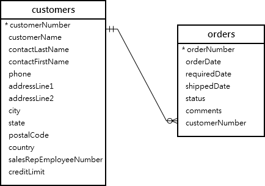

# MySQL LEFT JOIN

## Introduction to MySQL LEFT JOIN clause

The LEFT JOIN allows you to query data from two or more tables. Similar to the INNER JOIN clause, the LEFT JOIN is an optional clause of the SELECT statement, which appears immediately after the FROM clause.

Suppose that you want to join two tables t1 and t2.

The following statement shows how to use the LEFT JOIN clause to join the two tables:

```sql
SELECT
    select_list
FROM
    t1
LEFT JOIN t2 ON
    join_condition;
```

When you use the LEFT JOIN clause, the concepts of the left table and the right table are introduced.

In the above syntax, t1 is the left table and t2 is the right table.

The LEFT JOIN clause selects data starting from the left table (t1). It matches each row from the left table (t1) with every row from the right table(t2) based on the join_condition.

If the rows from both tables cause the join condition evaluates to true, the LEFT JOIN combine columns of rows from both tables to a new row and includes this new row in the result rows.

In case the row from the left table (t1) does not match with any row from the right table(t2), the LEFT JOIN still combines columns of rows from both tables into a new row and includes the new row in the result rows. However, it uses NULL for all the columns of the row from the right table.

In other words, LEFT JOIN returns all rows from the left table regardless of whether a row from the left table has a matching row from the right table or not.

If there is no match, the columns of the row from the right table will contain NULL.

The following Venn diagram helps you visualize how the LEFT JOIN clause works:


## MySQL LEFT JOIN clause examples

Let’s take some examples of using the LEFT JOIN clause.

### 1. Using MySQL LEFT JOIN clause to join two tables

See the following tables customers and orders in the sample database.



Each customer can have zero or more orders while each order must belong to one customer.

This query uses the LEFT JOIN clause to find all customers and their orders:

```sql
SELECT
    customers.customerNumber,
    customerName,
    orderNumber,
    status
FROM
    customers
LEFT JOIN orders ON
    orders.customerNumber = customers.customerNumber;
```

Alternatively, you can save some typing by using table aliases:

```sql
SELECT
    c.customerNumber,
    customerName,
    orderNumber,
    status
FROM
    customers c
LEFT JOIN orders o
    ON c.customerNumber = o.customerNumber;
```

In this example:

- The customers is the left table and orders is the right table.
- The LEFT JOIN clause returns all customers including the customers who have no order. If a customer has no order, the values in the column orderNumber and status are NULL.

Because both table customers and orders have the same column name ( customerNumber) in the join condition with the equal operator, you can use the USING syntax as follows:

```sql
SELECT
	customerNumber,
	customerName,
	orderNumber,
	status
FROM
	customers
LEFT JOIN orders USING (customerNumber);
```

The following clauses are equivalent:

```sql
USING (customerNumber)
```

And

```sql
ON c.customerNumber = o.customerNumber
```

If you replace the LEFT JOIN clause by the INNER JOIN clause, you will get the only customers who have at least one order.

### 2. Using MySQL LEFT JOIN clause to find unmatched rows

The LEFT JOIN clause is very useful when you want to find rows in a table that doesn’t have a matching row from another table.

The following example uses the LEFT JOIN to find customers who have no order:

```sql
SELECT
    c.customerNumber,
    c.customerName,
    o.orderNumber,
    o.status
FROM
    customers c
LEFT JOIN orders o
    ON c.customerNumber = o.customerNumber
WHERE
    orderNumber IS NULL;
```

### 3. Using MySQL LEFT JOIN to join three tables

See the following three tables employees, customers, and payments:


This example uses two LEFT JOIN clauses to join the three tables: employees, customers, and payments.

```sql
SELECT
    lastName,
    firstName,
    customerName,
    checkNumber,
    amount
FROM
    employees
LEFT JOIN customers ON
    employeeNumber = salesRepEmployeeNumber
LEFT JOIN payments ON
    payments.customerNumber = customers.customerNumber
ORDER BY
    customerName,
    checkNumber;

```

How it works.

- The first LEFT JOIN returns all employees and customers who represented each employee or NULL if the employee does not in charge of any customer.
- The second LEFT JOIN returns payments of each customer represented by an employee or NULL if the customer has no payment.

### Condition in WHERE clause vs. ON clause

See the following example.

```sql
SELECT
    o.orderNumber,
    customerNumber,
    productCode
FROM
    orders o
LEFT JOIN orderDetails
    USING (orderNumber)
WHERE
    orderNumber = 10123;

```

This example used the LEFT JOIN clause to query data from the tables orders and orderDetails. The query returns the order and its line items of the order number 10123.

However, if you move the condition from the WHERE clause to the ON clause:

```sql
SELECT
    o.orderNumber,
    customerNumber,
    productCode
FROM
    orders o
LEFT JOIN orderDetails d
    ON o.orderNumber = d.orderNumber AND
       o.orderNumber = 10123;
```

It will have a different meaning.

In this case, the query returns all orders but only the order 10123 will have line items associated with it as in the following picture:

Notice that for INNER JOIN clause, the condition in the ON clause is equivalent to the condition in the WHERE clause.

## Summary

- LEFT JOIN retrieves all rows from the left table and the matched rows from the right table.
- It returns NULL values for columns in the right table if no match is found based on the join condition.
- LEFT JOIN is useful for retrieving all records from the left table, regardless of whether they have matching records in the right table.
