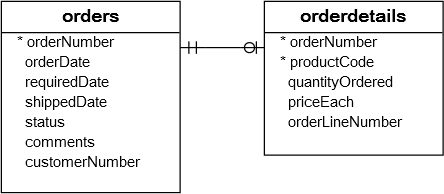

# MySQL SUBTOPICHERE

## Introduction to MySQL GROUP BY clause

The GROUP BY clause groups a set of rows into a set of summary rows by values of columns or expressions. The GROUP BY clause returns one row for each group. In other words, it reduces the number of rows in the result set.

The GROUP BY clause is an optional clause of the SELECT statement. The following illustrates the GROUP BY clause syntax:

```sql
SELECT
    c1, c2,..., cn, aggregate_function(ci)
FROM
    table
WHERE
    where_conditions
GROUP BY c1 , c2,...,cn;
```

In this syntax, you place the GROUP BY clause after the FROM and WHERE clauses. After the GROUP BY keywords, you place is a list of comma-separated columns or expressions to group rows.

MySQL evaluates the GROUP BY clause after the FROM and WHERE clauses and before the HAVING, SELECT, DISTINCT, ORDER BY and LIMIT clauses:


In practice, you often use the GROUP BY clause with aggregate functions such as SUM, AVG, MAX, MIN, and COUNT. The aggregate function that appears in the SELECT clause provides the information of each group.

## MySQL GROUP BY examples

Let’s take some examples of using the GROUP BY clause.

### A) Simple MySQL GROUP BY example

Let’s take a look at the orders table in the sample database.


```sql
SELECT
    status
FROM
    orders
GROUP BY status;
```

As you can see clearly from the output, the GROUP BY clause returns unique occurrences of status values. It works like the DISTINCT operator as shown in the following query:

```sql
SELECT DISTINCT
    status
FROM
    orders;
```

### B) Using MySQL GROUP BY with aggregate functions

The aggregate functions allow you to perform the calculation of a set of rows and return a single value. The GROUP BY clause is often used with an aggregate function to perform calculations and return a single value for each subgroup.

For example, if you want to know the number of orders in each status, you can use the COUNT function with the GROUP BY clause as follows:

```sql
SELECT
    status, COUNT(*)
FROM
    orders
GROUP BY status;
```

See the following orders and orderdetails table.



To get the total amount of all orders by status, you join the orders table with the orderdetails table and use the SUM function to calculate the total amount. See the following query:

```sql
SELECT
    status,
    SUM(quantityOrdered * priceEach) AS amount
FROM
    orders
INNER JOIN orderdetails
    USING (orderNumber)
GROUP BY
    status;
```

Similarly, the following query returns the order numbers and the total amount of each order.

```sql
SELECT
    orderNumber,
    SUM(quantityOrdered * priceEach) AS total
FROM
    orderdetails
GROUP BY
    orderNumber;
```

### C) MySQL GROUP BY with expression example

In addition to columns, you can group rows by expressions. The following query gets the total sales for each year.

```sql
SELECT
    YEAR(orderDate) AS year,
    SUM(quantityOrdered * priceEach) AS total
FROM
    orders
INNER JOIN orderdetails
    USING (orderNumber)
WHERE
    status = 'Shipped'
GROUP BY
    YEAR(orderDate);
```

In this example, we used the YEAR function to extract year data from order date ( orderDate). We included only orders with shipped status in the total sales. Note that the expression which appears in the SELECT clause must be the same as the one in the GROUP BY clause.

### D) Using MySQL GROUP BY with HAVING clause example

To filter the groups returned by GROUP BY clause, you use a HAVING clause. The following query uses the HAVING clause to select the total sales of the years after 2003.

```sql
SELECT
    YEAR(orderDate) AS year,
    SUM(quantityOrdered * priceEach) AS total
FROM
    orders
INNER JOIN orderdetails
    USING (orderNumber)
WHERE
    status = 'Shipped'
GROUP BY
    year
HAVING
    year > 2003;
```

## The GROUP BY clause: MySQL vs. SQL standard

The SQL standard does not allow you to use an alias in the GROUP BY clause whereas MySQL supports this.

For example, the following query extracts the year from the order date. It first uses the year as an alias of the expression YEAR(orderDate) and then uses the year alias in the GROUP BY clause.

The following query is not valid in SQL standard:

```sql
SELECT
    YEAR(orderDate) AS year,
    COUNT(orderNumber)
FROM
    orders
GROUP BY
    year;
```

Also, MySQL allows you to sort the groups in ascending or descending orders. The default sorting order is ascending. For example, if you want to get the number of orders by status and sort the status in descending order, you can use the GROUP BY clause with DESC as the following query:

```sql
SELECT
    status,
    COUNT(*)
FROM
    orders
GROUP BY
    status DESC;
```

Notice the DESC in the GROUP BY clause sorts the status in descending order. And you can also use the ASC explicitly in the GROUP BY clause to sort the groups by status in ascending order.

## The GROUP BY clause vs. DISTINCT clause

If you use the GROUP BY clause in the SELECT statement without using aggregate functions, the GROUP BY clause behaves like the DISTINCT clause.

The following statement uses the GROUP BY clause to select the unique states of customers from the customers table.

```sql
SELECT
    state
FROM
    customers
GROUP BY state;
```

You can achieve a similar result by using the DISTINCT clause:

```sql
SELECT DISTINCT
    state
FROM
    customers;
```

Generally speaking, the DISTINCT clause is a special case of the GROUP BY clause. The difference between DISTINCT clause and GROUP BY clause is that the GROUP BY clause sorts the result set, whereas the DISTINCT clause does not.

---

**_NOTE:_** Notice that MySQL 8.0 removed the implicit sorting for the GROUP BY clause. Therefore, if you use MySQL 8.0+, you will find that the result set of the above query with the GROUP BY clause is not sorted.

---

If you add the ORDER BY clause to the statement that uses the DISTINCT clause, the result set is sorted, and it is the same as the one returned by the statement that uses GROUP BY clause.

```sql
SELECT DISTINCT
    state
FROM
    customers
ORDER BY
    state;
```

## SUMMARY

- GROUP BY is a clause in MySQL used to group rows based on one or more columns.
- It is typically used in conjunction with aggregate functions like COUNT, SUM, AVG, etc., to perform calculations on grouped data.
- GROUP BY allows you to summarize data by creating groups and applying aggregate functions to each group, resulting in a consolidated view of the data.
