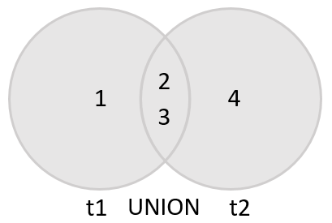
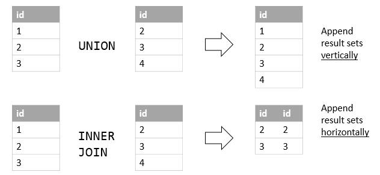
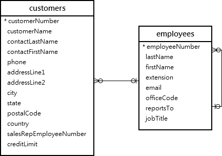

# MySQL UNION

## Introduction to MySQL UNION operator

MySQL UNION operator allows you to combine two or more result sets of queries into a single result set. The following illustrates the syntax of the UNION operator:

```sql
SELECT column_list
UNION [DISTINCT | ALL]
SELECT column_list
UNION [DISTINCT | ALL]
SELECT column_list
...
```

To combine result set of two or more queries using the UNION operator, these are the basic rules that you must follow:

- First, the number and the orders of columns that appear in all SELECT statements must be the same.
- Second, the data types of columns must be the same or compatible.

By default, the UNION operator removes duplicate rows even if you don’t specify the DISTINCT operator explicitly.

Let’s see the following sample tables: t1 and t2:

```sql
DROP TABLE IF EXISTS t1;
DROP TABLE IF EXISTS t2;

CREATE TABLE t1 (
    id INT PRIMARY KEY
);

CREATE TABLE t2 (
    id INT PRIMARY KEY
);

INSERT INTO t1 VALUES (1),(2),(3);
INSERT INTO t2 VALUES (2),(3),(4);
```

The following statement combines result sets returned from t1 and t2 tables:

```sql
SELECT id
FROM t1
UNION
SELECT id
FROM t2;
```

Because the rows with value 2 and 3 are duplicates, the UNION removed them and kept only unique values.

The following Venn diagram illustrates the union of two result sets that come from t1 and t2 tables:



If you use the UNION ALL explicitly, the duplicate rows, if available, remain in the result. Because UNION ALL does not need to handle duplicates, it performs faster than UNION DISTINCT .

```sql
SELECT id
FROM t1
UNION ALL
SELECT id
FROM t2;
```

As you can see, the duplicates appear in the combined result set because of the UNION ALL operation.

##UNION vs. JOIN

A JOIN combines result sets horizontally, a UNION appends result set vertically. The following picture illustrates the difference between UNION and JOIN:



## MySQL UNION and column alias examples

We’ll use the customers and employees tables in the sample database for the demonstration:



Suppose that you want to combine the first name and last name of employees and customers into a single result set, you can use the UNION operator as follows:

```sql
SELECT
    firstName,
    lastName
FROM
    employees
UNION
SELECT
    contactFirstName,
    contactLastName
FROM
    customers;
```

As you can see from the output, the MySQL UNION uses the column names of the first SELECT statement for the column headings of the output.

If you want to use other column headings, you need to use column aliases explicitly in the first SELECT statement as shown in the following example:

```sql
SELECT
    CONCAT(firstName,' ',lastName) fullname
FROM
    employees
UNION SELECT
    CONCAT(contactFirstName,' ',contactLastName)
FROM
    customers;
```

This example uses the column heading of the first query for the output. It uses the CONCAT() function to concatenate first name, space, and last name into a full name.

## MySQL UNION and ORDER BY

If you want to sort the result set of a union, you use an ORDER BY clause in the last SELECT statement as shown in the following example:

```sql
SELECT
    concat(firstName,' ',lastName) fullname
FROM
    employees
UNION SELECT
    concat(contactFirstName,' ',contactLastName)
FROM
    customers
ORDER BY fullname;
```

Notice that if you place the ORDER BY clause in each SELECT statement, it will not affect the order of the rows in the final result set.

To differentiate between employees and customers, you can add a column as shown in the following query:

```sql
SELECT
    CONCAT(firstName, ' ', lastName) fullname,
    'Employee' as contactType
FROM
    employees
UNION SELECT
    CONCAT(contactFirstName, ' ', contactLastName),
    'Customer' as contactType
FROM
    customers
ORDER BY
    fullname
```

MySQL also provides you with an alternative option to sort a result set based on column position using ORDER BY clause as follows:

```sql
SELECT
    CONCAT(firstName,' ',lastName) fullname
FROM
    employees
UNION SELECT
    CONCAT(contactFirstName,' ',contactLastName)
FROM
    customers
ORDER BY 1;
```

However, it is not a good practice to sort the result set by column position.

## Summary

- UNION is a SQL operator in MySQL used to combine the results of multiple SELECT statements into a single result set.
- It allows you to merge rows from different tables or queries that have the same column structure.
- UNION eliminates duplicate rows by default, but you can use UNION ALL to include all rows, including duplicates, in the combined result set.
