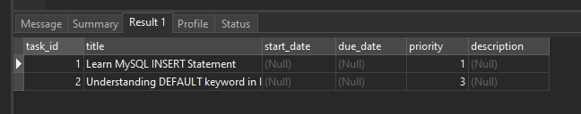

# MySQL Insert

## Introduction to the MySQL INSERT statement

The INSERT statement allows you to insert one or more rows into a table. The following illustrates the syntax of the INSERT statement:

```sql
INSERT INTO table(c1,c2,...)
VALUES (v1,v2,...);
```

In this syntax,

- First, specify the table name and a list of comma-separated columns inside parentheses after the INSERT INTO clause.
- Then, put a comma-separated list of values of the corresponding columns inside the parentheses following the VALUES keyword.

The number of columns and values must be the same. In addition, the positions of columns must be corresponding with the positions of their values.

To insert multiple rows into a table using a single INSERT statement, you use the following syntax:

```sql
INSERT INTO table(c1,c2,...)
VALUES
   (v11,v12,...),
   (v21,v22,...),
    ...
   (vnn,vn2,...);
```

In this syntax, rows are separated by commas in the VALUES clause.

## MySQL INSERT examples

Let’s create a new table named tasks for practicing the INSERT statement.

```sql
CREATE TABLE IF NOT EXISTS tasks (
    task_id INT AUTO_INCREMENT,
    title VARCHAR(255) NOT NULL,
    start_date DATE,
    due_date DATE,
    priority TINYINT NOT NULL DEFAULT 3,
    description TEXT,
    PRIMARY KEY (task_id)
);
```

### 1) MySQL INSERT – simple INSERT example

The following statement inserts a new row into the tasks table:

```sql
INSERT INTO tasks(title,priority)
VALUES('Learn MySQL INSERT Statement',1);
```

MySQL returns the following message:


It means that one row has been inserted into the tasks table successfully.

This query returns data from the tasks table:

```sql
SELECT * FROM tasks;
```

Will give an output of:


In this example, we specified the values for only title and priority columns. For other columns, MySQL uses the default values.

The task_id column is an AUTO_INCREMENT column. It means that MySQL generates a sequential integer whenever a row is inserted into the table.

The start_date, due_date, and description columns use NULL as the default value, therefore, MySQL uses NULL to insert into these columns if you don’t specify their values in the INSERT statement.

### 2) MySQL INSERT – Inserting rows using default value example

If you want to insert a default value into a column, you have two ways:

- Ignore both the column name and value in the INSERT statement.
- Specify the column name in the INSERT INTO clause and use the DEFAULT keyword in the VALUES clause.

The following example demonstrates the second way:

```sql
INSERT INTO tasks(title,priority)
VALUES('Understanding DEFAULT keyword in INSERT statement',DEFAULT);
```

In this example, we specified the priority column and the DEFAULT keyword.

Because the default value for the column priority is 3 as declared in the table definition:

```sql
priority TINYINT NOT NULL DEFAULT 3
```

MySQL uses the number 3 to insert into the priority column.

The following statement returns the contents of the tasks table after the insert:

```sql
SELECT * FROM tasks;
```



### 3) MySQL INSERT – Inserting dates into the table example

To insert a literal date value into a column, you use the following format:

```sql
'YYYY-MM-DD'
```

In this format:

- YYYY represents a four-digit year e.g., 2018.
- MM represents a two-digit month e.g., 01, 02, and 12.
- DD represents a two-digit day e.g., 01, 02, 30.

The following statement inserts a new row to the tasks table with the start and due date values:

```sql
INSERT INTO tasks(title, start_date, due_date)
VALUES('Insert date into table','2018-01-09','2018-09-15');
```

The image below shows the contents of the tasks table after the insert:


It is possible to use expressions in the VALUES clause. For example, the following statement adds a new task using the current date for start date and due date columns:

```sql
INSERT INTO tasks(title,start_date,due_date)
VALUES('Use current date for the task',CURRENT_DATE(),CURRENT_DATE())
```

In this example, we used the CURRENT_DATE() function as the values for the start_date and due_date columns. Note that the CURRENT_DATE() function is a date function that returns the current system date.

Here are the contents of the tasks table after insert:


### 4) MySQL INSERT – Inserting multiple rows example

The following statement inserts three rows into the tasks table:

```sql
INSERT INTO tasks(title, priority)
VALUES
	('My first task', 1),
	('It is the second task',2),
	('This is the third task of the week',3);
```

In this example, each row data is specified as a list of values in the VALUES clause.

MySQL returns the following message:

```sql
3 row(s) affected Records: 3  Duplicates: 0  Warnings: 0
```

It means that the three rows have been inserted successfully with no duplicates or warnings.

```sql
SELECT * FROM tasks;
```

The table tasks has the following data:


## Summary

- The INSERT statement in MySQL is used to add new rows into a table.
- It allows you to specify the table name and column names to insert values into.
- You can insert values directly or retrieve them from another table or query using a SELECT statement.
