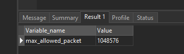
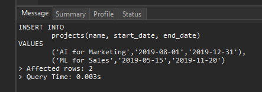
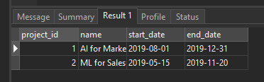

# MySQL Insert Multiple Rows

## Introduction to MySQL INSERT multiple rows statement

To insert multiple rows into a table, you use the following form of the INSERT statement:

```sql
INSERT INTO table_name (column_list)
VALUES
	(value_list_1),
	(value_list_2),
	...
	(value_list_n);

```

In this syntax:

- First, specify the name of table that you want to insert after the INSERT INTO keywords.
- Second, specify a comma-separated column list inside parentheses after the table name.
- Third, specify a comma-separated list of row data in the VALUES clause. Each element of the list represents a row. The number of values in each element must be the same as the number of columns in the column_list.

## MySQL INSERT multiple rows limit

In theory, you can insert any number of rows using a single INSERT statement. However, when MySQL server receives the INSERT statement whose size is bigger than max_allowed_packet, it will issue a packet too large error and terminates the connection.

This statement shows the current value of the max_allowed_packet variable:

```sql
SHOW VARIABLES LIKE 'max_allowed_packet';
```

Here is the output on our MySQL database server. Note that the value in your server may be different.



where size is an integer that represents the number the maximum allowed packet size in bytes.

Note that the max_allowed_packet has no influence on the INSERT INTO .. SELECT statement. The INSERT INTO .. SELECT statement can insert as many rows as you want.

## MySQL INSERT multiple rows example

Let’s take an example of using the INSERT multiple rows statement.

First, create a new table called projects for the demonstration:

```sql
CREATE TABLE projects(
	project_id INT AUTO_INCREMENT,
	name VARCHAR(100) NOT NULL,
	start_date DATE,
	end_date DATE,
	PRIMARY KEY(project_id)
);
```

Second, use the INSERT multiple rows statement to insert two rows into the projects table:

```sql
INSERT INTO
	projects(name, start_date, end_date)
VALUES
	('AI for Marketing','2019-08-01','2019-12-31'),
	('ML for Sales','2019-05-15','2019-11-20');

```

MySQL issued the following message:



It means that two rows have been inserted into the projects table successfully.

Note that when you insert multiple rows and use the LAST_INSERT_ID() function to get the last inserted id of an AUTO_INCREMENT column, you will get the id of the first inserted row only, not the id of the last inserted row.

Third, use the following SELECT statement to verify the inserts:

```sql
SELECT * FROM projects;
```

This picture shows the output:



## Summary

- MySQL allows you to insert multiple rows into a table using a single INSERT statement.
- To insert multiple rows, you need to specify the values for each row using the VALUES keyword and separate them with commas.
