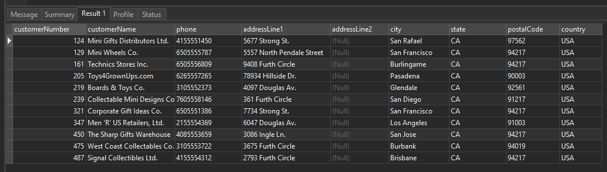
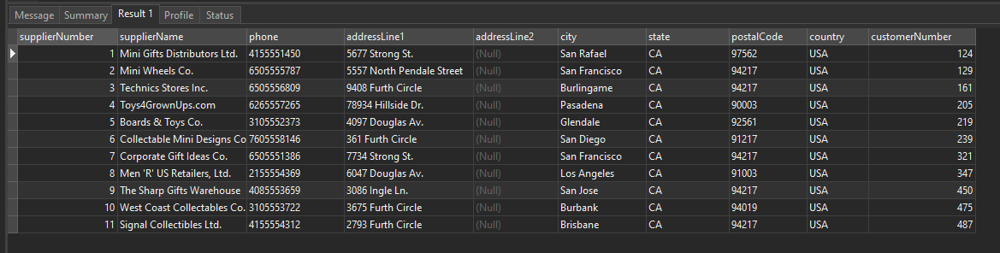

# MySQL INSERT INTO SELECT

## MySQL INSERT INTO SELECT Overview

In the previous lecture, we have learned how to insert one or more rows into a table using the INSERT statement with a list of column values specified in the VALUES clause.

```sql
INSERT INTO table_name(c1,c2,...)
VALUES(v1,v2,..);
```

Besides using row values in the VALUES clause, you can use the result of a SELECT statement as the data source for the INSERT statement.

The following illustrates the syntax of the INSERT INTO SELECT statement:

```sql
INSERT INTO table_name(column_list)
SELECT
   select_list
FROM
   another_table
WHERE
   condition;
```

In this syntax, instead of using the VALUES clause, you can use a SELECT statement. The SELECT statement can retrieve data from one or more tables.

The INSERT INTO SELECT statement is very useful when you want to copy data from other tables to a table or to summary data from multiple tables into a table.

## MySQL INSERT INTO SELECT example

First, create a new table calledsuppliers :

```sql
CREATE TABLE suppliers (
    supplierNumber INT AUTO_INCREMENT,
    supplierName VARCHAR(50) NOT NULL,
    phone VARCHAR(50),
    addressLine1 VARCHAR(50),
    addressLine2 VARCHAR(50),
    city VARCHAR(50),
    state VARCHAR(50),
    postalCode VARCHAR(50),
    country VARCHAR(50),
    customerNumber INT,
    PRIMARY KEY (supplierNumber)
);
```

Note that you will learn how to create a new table in the subsequent tutorial. For now, you just need to execute this statement to create the suppliers table.

Suppose all customers from California, USA become the company’s suppliers. The following query finds all customers who locate in California, USA:

```sql
SELECT
    customerNumber,
    customerName,
    phone,
    addressLine1,
    addressLine2,
    city,
    state,
    postalCode,
    country
FROM
    customers
WHERE
    country = 'USA' AND
    state = 'CA';
```



Second, use the INSERT INTO ... SELECT statement to insert customers who locate in California USA from the customers table into the suppliers table:

```sql
INSERT INTO suppliers (
    supplierName,
    phone,
    addressLine1,
    addressLine2,
    city,
    state,
    postalCode,
    country,
    customerNumber
)
SELECT
    customerName,
    phone,
    addressLine1,
    addressLine2,
    city,
    state ,
    postalCode,
    country,
    customerNumber
FROM
    customers
WHERE
    country = 'USA' AND
    state = 'CA';
```

It returned the following message indicating that 11 rows have been inserted successfully.


Third, verify the insert by querying data from the suppliers table:

```sql
SELECT * FROM suppliers;
```



## Using SELECT statement in the VALUES list

First, create a new table called stats:

```sql
CREATE TABLE stats (
    totalProduct INT,
    totalCustomer INT,
    totalOrder INT
);
```

Second, use the INSERT statement to insert values that come from the SELECT statements:

```sql
INSERT INTO stats(totalProduct, totalCustomer, totalOrder)
VALUES(
	(SELECT COUNT(*) FROM products),
	(SELECT COUNT(*) FROM customers),
	(SELECT COUNT(*) FROM orders)
);
```

In this example:

- First, use the SELECT statements with the COUNT() functions to get the total products, employees, and orders.
- Second, use the values returned from the SELECT statement in place of values in the VALUES clause of the INSERT statement.
- Third, query data from the tablestats:


## Summary

- The INSERT INTO SELECT statement in MySQL allows you to insert rows into a table based on the results of a SELECT query.
- It enables you to copy data from one table to another or selectively insert data from specific columns or conditions.
- The column names and data types in the target table must match the column names and data types in the SELECT statement.
