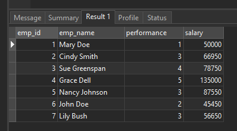

# MySQL UPDATE JOIN

## MySQL UPDATE JOIN syntax

You often use joins to query rows from a table that have (in the case of INNER JOIN) or may not have (in the case of LEFT JOIN) matching rows in another table. In MySQL, you can use the JOIN clauses in the UPDATE statement to perform the cross-table update.

The syntax of the MySQL UPDATE JOIN is as follows:

```sql
UPDATE T1, T2,
[INNER JOIN | LEFT JOIN] T1 ON T1.C1 = T2. C1
SET T1.C2 = T2.C2,
    T2.C3 = expr
WHERE condition
```

Let’s examine the MySQL UPDATE JOIN syntax in greater detail:

- First, specify the main table ( T1 ) and the table that you want the main table to join to ( T2 ) after the UPDATE clause. Notice that you must specify at least one table after the UPDATE clause. The data in the table that is not specified after the UPDATE clause will not be updated.
- Next, specify a kind of join you want to use i.e., either INNER JOIN or LEFT JOIN and a join predicate. The JOIN clause must appear right after the UPDATE clause.
- Then, assign new values to the columns in T1 and/or T2 tables that you want to update.
- After that, specify a condition in the WHERE clause to limit rows to rows for updating.

If you follow the UPDATE statement lecture, you will notice that there is another way to update data cross-table using the following syntax:

```sql
UPDATE T1, T2
SET T1.c2 = T2.c2,
      T2.c3 = expr
WHERE T1.c1 = T2.c1 AND condition
```

This UPDATE statement works the same as UPDATE JOIN with an implicit INNER JOIN clause. It means you can rewrite the above statement as follows:

```sql
UPDATE T1,T2
INNER JOIN T2 ON T1.C1 = T2.C1
SET T1.C2 = T2.C2,
      T2.C3 = expr
WHERE condition
```

et’s take a look at some examples of using the UPDATE JOIN statement to having a better understanding.

## MySQL UPDATE JOIN examples

We are going to use a new sample database named empdb in for demonstration. This sample database consists of two tables:

The employees table stores employee data with employee id, name, performance, and salary.
The merits table stores employee performance and merit’s percentage.
The following statements create and load data in the empdb sample database:

```sql
CREATE DATABASE IF NOT EXISTS empdb;

USE empdb;

-- create tables
CREATE TABLE merits (
    performance INT(11) NOT NULL,
    percentage FLOAT NOT NULL,
    PRIMARY KEY (performance)
);

CREATE TABLE employees (
    emp_id INT(11) NOT NULL AUTO_INCREMENT,
    emp_name VARCHAR(255) NOT NULL,
    performance INT(11) DEFAULT NULL,
    salary FLOAT DEFAULT NULL,
    PRIMARY KEY (emp_id),
    CONSTRAINT fk_performance FOREIGN KEY (performance)
        REFERENCES merits (performance)
);
-- insert data for merits table
INSERT INTO merits(performance,percentage)
VALUES(1,0),
      (2,0.01),
      (3,0.03),
      (4,0.05),
      (5,0.08);
-- insert data for employees table
INSERT INTO employees(emp_name,performance,salary)
VALUES('Mary Doe', 1, 50000),
      ('Cindy Smith', 3, 65000),
      ('Sue Greenspan', 4, 75000),
      ('Grace Dell', 5, 125000),
      ('Nancy Johnson', 3, 85000),
      ('John Doe', 2, 45000),
      ('Lily Bush', 3, 55000);
```

## MySQL UPDATE JOIN example with INNER JOIN clause

Suppose you want to adjust the salary of employees based on their performance.

The merit’s percentages are stored in the merits table, therefore, you have to use the UPDATE INNER JOIN statement to adjust the salary of employees in the employees table based on the percentage stored in the merits table.

The link between the employees and merit tables is the performance field. See the following query:

```sql
UPDATE employees
        INNER JOIN
    merits ON employees.performance = merits.performance
SET
    salary = salary + salary * percentage;
```

Run the query

```sql
SELECT * FROM employees
```



How the query works.

We specify only the employees table after UPDATE clause because we want to update data in the employees table only.

For each row in the employees table, the query checks the value in the performance column against the value in the performance column in the merits table. If it finds a match, it gets the percentage in the merits table and updates the salary column in the employees table.

Because we omit the WHERE clause in the UPDATE statement, all the records in the employees table get updated.

## MySQL UPDATE JOIN example with LEFT JOIN

Suppose the company hires two more employees:

```sql
INSERT INTO employees(emp_name,performance,salary)
VALUES('Jack William',NULL,43000),
      ('Ricky Bond',NULL,52000);
```

Because these employees are new hires so their performance data is not available or NULL .


To increase the salary for new hires, you cannot use the UPDATE INNER JOIN statement because their performance data is not available in the merit table. This is why the UPDATE LEFT JOIN comes to the rescue.

The UPDATE LEFT JOIN statement basically updates a row in a table when it does not have a corresponding row in another table.

For example, you can increase the salary for a new hire by 1.5% using the following statement:

```sql
UPDATE employees
        LEFT JOIN
    merits ON employees.performance = merits.performance
SET
    salary = salary + salary * 0.015
WHERE
    merits.percentage IS NULL;
```

```sql
SELECT * FROM employees
```


## Summary

- UPDATE JOIN is a technique in MySQL that allows you to update columns in one table based on a join with another table.
- It combines the UPDATE statement with the JOIN statement to specify the relationship between the tables and the conditions for updating the data.
- UPDATE JOIN is useful when you need to update data in one table based on the values or conditions in another related table.
