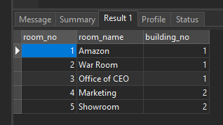

# MySQL ON DELETE CASCADE

## MySQL ON DELETE CASCADE example

Let’s take a look at an example of using MySQL ON DELETE CASCADE .

Suppose that we have two tables:buildings and rooms . In this database model, each building has one or many rooms. However, each room belongs to one only one building. A room would not exist without a building.

The relationship between the buildings and rooms tables is one-to-many (1:N) as illustrated in the following database diagram:


When you delete a row from the buildings table, you also want to delete all rows in the rooms table that references to the row in the buildings table. For example, when you delete a row with building no. 2 in the buildings table as the following query:

```sql
DELETE FROM buildings
WHERE building_no = 2;
```

You also want the rows in the rooms table that refers to building number 2 will be also removed.

The following are steps that demonstrate how the ON DELETE CASCADE referential action works.

<strong>Step 1. </strong> Create the buildings table:

```sql
CREATE TABLE buildings (
    building_no INT PRIMARY KEY AUTO_INCREMENT,
    building_name VARCHAR(255) NOT NULL,
    address VARCHAR(255) NOT NULL
);
```

<strong>Step 2. </strong> Create the rooms table:

```sql
CREATE TABLE rooms (
    room_no INT PRIMARY KEY AUTO_INCREMENT,
    room_name VARCHAR(255) NOT NULL,
    building_no INT NOT NULL,
    FOREIGN KEY (building_no)
        REFERENCES buildings (building_no)
        ON DELETE CASCADE
);
```

<strong>Step 3. </strong> Insert rows into the buildings table:

```sql
INSERT INTO buildings(building_name,address)
VALUES('ACME Headquaters','3950 North 1st Street CA 95134'),
      ('ACME Sales','5000 North 1st Street CA 95134');
```

<strong>Step 4. </strong>Query data from the buildings table:

```sql
SELECT * FROM buildings;
```


<strong>Step 5. </strong> Insert rows into the rooms table:

```sql
INSERT INTO rooms(room_name,building_no)
VALUES('Amazon',1),
      ('War Room',1),
      ('Office of CEO',1),
      ('Marketing',2),
      ('Showroom',2);
```

<strong>Step 6. </strong> Query data from the rooms table:

```sql
SELECT * FROM rooms;
```



We have three rooms that belong to building no 1 and two rooms that belong to the building no 2.
<strong>Step 7. </strong>Delete the building with building no. 2:

```sql
DELETE FROM buildings
WHERE building_no = 2;
```

<strong>Step 8. </strong> Query data from rooms table:

```sql
SELECT * FROM rooms;
```


As you can see, all the rows that reference to building_no 2 were automatically deleted.

Notice that ON DELETE CASCADE works only with tables with the storage engines that support foreign keys.

## Tips to find tables affected by MySQL ON DELETE CASCADE action

Sometimes, it is useful to know which table is affected by the ON DELETE CASCADE referential action when you delete data from a table. You can query this data from the referential_constraints in the information_schema database as follows:

```sql
USE information_schema;

SELECT
    table_name
FROM
    referential_constraints
WHERE
    constraint_schema = 'database_name'
        AND referenced_table_name = 'parent_table'
        AND delete_rule = 'CASCADE'
```

For example, to find tables that associated with the buildings table with the CASCADE deletion rule in the classicmodels database, you use the following query:

```sql
USE information_schema;

SELECT
    table_name
FROM
    referential_constraints
WHERE
    constraint_schema = 'cardbdemo'
        AND referenced_table_name = 'buildings'
        AND delete_rule = 'CASCADE'
```


