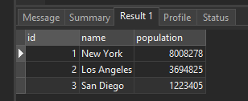
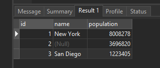
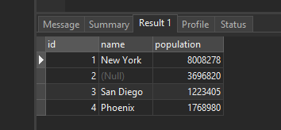
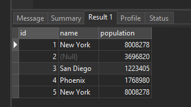

# MySQL REPLACE

## Introduction to MySQL REPLACE statement

The MySQL REPLACE statement is an extension to the SQL Standard. The MySQL REPLACE statement works as follows:

Step 1. Insert a new row into the table, if a duplicate key error occurs.

Step 2. If the insertion fails due to a duplicate-key error occurs:

- Delete the conflicting row that causes the duplicate key error from the table.
- Insert the new row into the table again.

To determine whether the new row that already exists in the table, MySQL uses PRIMARY KEY or UNIQUE KEY index. If the table does not have one of these indexes, the REPLACE works like an INSERT statement.

To use the REPLACE statement, you need to have at least both INSERT and DELETE privileges for the table.

## Using MySQL REPLACE to insert a new row

The following illustrates the syntax of the REPLACE statement:

```sql
REPLACE [INTO] table_name(column_list)
VALUES(value_list);
```

It is similar to the INSERT statement except for the keyword REPLACE.
Let’s take a look at the following example of using the REPLACE statement to see how it works.

First, create a new table named cities as follows:

```sql
CREATE TABLE cities (
    id INT AUTO_INCREMENT PRIMARY KEY,
    name VARCHAR(50),
    population INT NOT NULL
);

```

Next, insert some rows into the cities table:

```sql
INSERT INTO cities(name,population)
VALUES('New York',8008278),
	  ('Los Angeles',3694825),
	  ('San Diego',1223405);
```

Then, query data from the cities table to verify the insert operation.

```sql
SELECT * FROM cities;
```



After that, use the REPLACE statement to update the population of the Los Angeles city to 3696820.

```sql
REPLACE INTO cities(id,population)
VALUES(2,3696820);
```

Finally, query the data of the cities table again to verify the replacement.

```sql
SELECT * FROM cities;
```



The value in the name column is NULL now. The REPLACE statement works as follows:

1. First, REPLACE statement attempted to insert a new row into cities the table. The insertion failed because the id 2 already exists in the cities table.
2. Then, REPLACE statement deleted the row with id 2 and inserted a new row with the same id 2 and population 3696820. Because no value is specified for the name column, it was set to NULL.

## Using MySQL REPLACE statement to update a row

The following illustrates how to use the REPLACE statement to update data:

```sql
REPLACE INTO table
SET column1 = value1,
    column2 = value2;
```

This statement is like the UPDATE statement except for the REPLACE keyword. In addition, it has no WHERE clause.

This example uses the REPLACE statement to update the population of the Phoenix city to 1768980:

```sql
REPLACE INTO cities
SET id = 4,
    name = 'Phoenix',
    population = 1768980;
```

Unlike the UPDATE statement, if you don’t specify the value for the column in the SET clause, the REPLACE statement will use the default value of that column.

```sql
SELECT * FROM cities;
```



## Using MySQL REPLACE to insert data from a SELECT statement

The following illustrates the REPLACE statement that inserts data into a table with the data come from a query.

```sql
REPLACE INTO table_1(column_list)
SELECT column_list
FROM table_2
WHERE where_condition;
```

Note that this form of the REPLACE statement is similar to INSERT INTO SELECT statement.

The following statement uses the REPLACE INTO statement to copy a row within the same table:

```sql
REPLACE INTO
    cities(name,population)
SELECT
    name,
    population
FROM
   cities
WHERE id = 1;
```



## Summary

- The REPLACE statement in MySQL is used to insert a new row into a table or replace an existing row based on a primary key or unique index.
- If a row with the same primary key or unique index exists, it will be deleted and replaced with the new row.
- If the row doesn't exist, a new row will be inserted. In either case, the table structure and column data types must match for the REPLACE statement to work.
